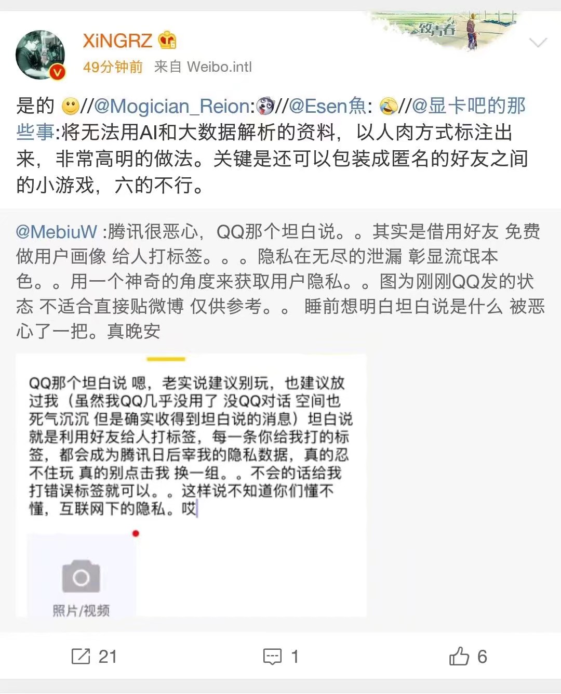

# Course-Design
2018 C++ Course Design backup. 

题目:


几点说明如下:

-   关于测试数据, 均存放在相应文件夹内, 本着方便的原则,代码中已将标准输入重定向, 直接删掉freopen()函数前的单行注释符即可.
-   面向过程!面向过程!面向过程!
-   头文件cstdio不必须, 仅为使用freopen()方便.
-   依旧本着方便的原则, 代码中大量使用全局变量.
-   第六题大量使用stl以及C++11标准中新增加以及修改的内容以简化代码便于阅读.如auto关键字的使用.关于auto关键字,可参考[huang_xw](https://blog.csdn.net/huang_xw/article/details/8760403)的博文.代码中主要用到的是auto自动类型推断的特性,如自动推断迭代器类型.


时间点:

2018-07-04 11:38am.完结撒花.

2018-07-04 02:35pm. 凉凉,全是bug...

2018-07-04 04:40pm. 问题不大,稳住还有最后一题各种特判就结束啦 ~~(再次撒花~~

2018-07-04 09:10pm.  这次是真的可以撒花了吧(尽管仍然各种bug,但T6绝对不改了!233,来自英语渣的自暴自弃.

2018-07-05 09:00am.   T6测试文本改用《圣经》前12000行... ~~(关于为什么不用圣经全文,我也想啊,233,但是抛了个异常给我啊,我也很绝望啊.~~

```bash
terminate called after throwing an instance of 'std::out_of_range'
  what():  basic_string::erase: __pos (which is 18446744073709551615) > this->size() (which is 0).
```

搜索了一圈截至目前没有找到解决方法,2333.

2018-07-05 11:00am.    上面那个越界的问题解决了, 原因是单符号以及单数字的出现, erase后变成空串, 这时候在调用erase就抛异常了. ~~(可以愉快的分析圣经全文啦. 双符号结尾误删的bug不改啦, 直接白名单解决. 算了,不解决了, 虽说加上去也不肯能再拉低时间复杂度了~~


胡言乱语几句:

来看看《圣经》中出现次数最高的10个单词吧:

```c++
Wordlist            Times               

the                 65814               
and                 44959               
of                  37921               
to                  26518               
in                  15180               
you                 12917               
for                 11980               
will                10699               
is                  10337               
his                 9365 
```

没什么感觉, 全是介词之类的没什么实际含义的, 除了rate 10疯狂暗示书里主要讲述的是男人们之间的那些事儿.那就看看前100:

```c++
Wordlist            Times               

the                 65814               
and                 44959               
of                  37921               
to                  26518               
in                  15180               
you                 12917               
for                 11980               
will                10699               
is                  10337               
his                 9365                
be                  9167                
he                  9155                
your                7988                
lord                7905                
it                  7488                
on                  7223                
have                7125                
not                 6164                
him                 6123                
they                6104                
with                5994                
are                 5946                
all                 5909                
was                 5887                
said                5734                
my                  5663                
who                 5655                
from                5553                
that                5540                
them                5388                
their               5048                
put                 4701                
god                 4574                
but                 4470                
give                4131                
by                  4077                
so                  3976                
me                  3931                
has                 3793                
son                 3734                
had                 3688                
made                3646                
come                3640                
which               3628                
were                3462                
this                3410                
as                  3350                
no                  3326                
go                  3318                
up                  3245                
let                 3091                
king                3082                
man                 3055                
out                 3045                
when                2858                
make                2783                
came                2744                
then                2726                
say                 2642                
take                2639                
do                  2638                
people              2568                
there               2562                
israel              2541                
went                2533                
psm                 2461                
one                 2407                
day                 2342                
land                2311                
may                 2297                
gave                2183                
word                2157                
men                 2141                
into                2102                
or                  2080                
if                  2078                
before              1969                
an                  1964                
those               1950                
at                  1946                
her                 1942                
away                1890                
because             1877                
now                 1865                
what                1859                
against             1845                
children            1807                
given               1766                
father              1755                
took                1747                
house               1735                
hand                1716                
death               1711                
see                 1693                
been                1656                
thing               1643                
we                  1642                
place               1608                
great               1566                
gen                 1533
```

这会儿感觉...明明白白的,刺激. (改明儿考六级先把历年阅读真题分析下?手动滑稽

想起了早上看到的一条关于QQ坦白说的微博



还好用着google play万年不更的QQ 6.6.7 ~~(暗自欺骗自己~~. 不过说句实话, 为人的隐私越来越不能称之为隐私了, 就像那谁说的: 人在懒惰天性的驱使宁愿牺牲隐私去换取一时的方便. 很有道理 ~~(庆幸自己还没有愚蠢到那种地步.~~


一年后整理repo发现。。。自己一年前和现在比怎么差了点意思？