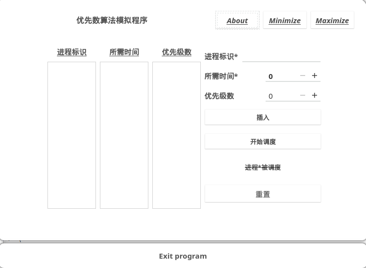

# Course-Design
2019 OS Course Design backup.

题目：

处理机调度和内存调度，两个大模拟题，给了个文档，懒得去看，就直接动手写了。

开发环境：

OS：Linux 4.19.49-1-MANJARO #1 SMP PREEMPT Sun Jun 9 20:24:20 UTC 2019 x86_64 GNU/Linux

IDE：Qt Creator 4.9.1

QT version：Qt 5.12.3

GCC version：8.3.0，64bit

时间点：

2019-07-01：摸鱼的一整天，上午毛概考卷没写完就很气，但总算不会挂科的说。

2019-07-02：依旧摸鱼，只是大致确定了老师的要求是什么。写gui，改语言，改算法，还有一个啥来着。。。

2019-07-03：上午jsp期末大作业验收。这。。。我怎么又摸鱼了啊，我课设还想拿优呢。不过好在确定了就用qt写了，有推进了。破站找了套10h的qt视频看了会，看了大概一半吧，两倍速看的，实际用时3-4h，因为有些地方倒回去看了好几遍。

2019-07-04：起了个大早准备今天结束掉，然后。。。又摸鱼了，因为一拳超人第二季葡萄free了，赶紧下载心满意足的看了。离课设答辩只有以小时计的时间，我怎么可以一点点都不慌，我凉了啊。一直摸鱼到晚八点。。。我是真的要开始写了。

2019-07-05：一写就写到了凌晨三点半，不知到为什么没感到困，难倒是不难，麻烦的是各种关联太多了，大半夜的哪管得了这么多，写就完事了，写完再调试改bug。凌晨三点半，完事了，我能发现的bug都改好了。睡到早七点爬起来写报告。写报告怎么比写代码还烦啊，居然用掉了将近四个小时？不过有差不多七十页，也挺满意的了。真答辩啊这是，一分钟演示了下，然后老师说了一句写成这样还用问问题吗，无答无辩，真好。来回计算机楼和宿舍之间以及打印报告花了1h左右，结果两分钟？不过想到拿到了全专业第一个课设优，又直接省掉了答辩环节，两分钟结束回宿舍继续摸鱼了，是很舒服的了。

程序截图：

总结：

感觉调度这一块就是维护已分配表和空闲表，执行调度的时候就查相应的表，可以调度就转去调度，无法实现调度就等待或者用其他方法尽量满足调度需求。而各种乱七八糟的调度算法之间的差异就只是维护表的方法不同。没有完美的调度算法，只能说是视情况而定动态调整调度算法以接近完美吧。

以及qt入门真简单。。。

